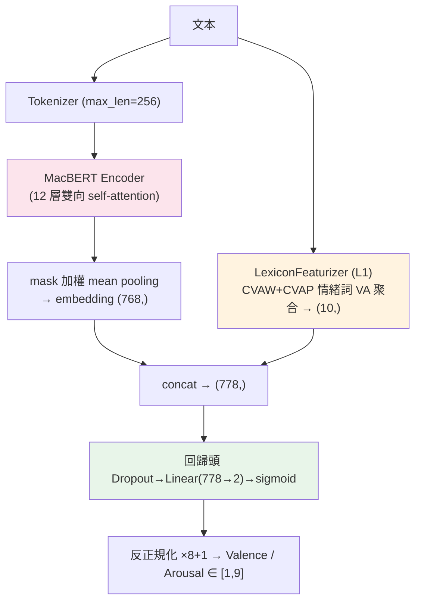
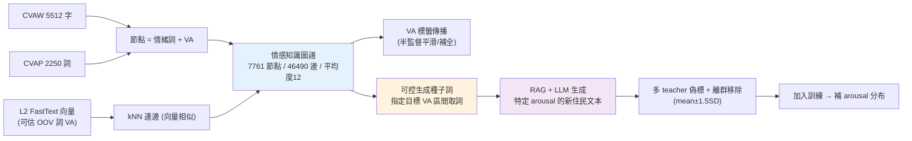

# Current Pipeline — DSA-NIDF (ROCLING 2026)

任務：對新住民自我反思文本預測 valence / arousal（1–9 實數）。
評分：V/A 各算 MAE(↓) + PCC(↑)，4 指標 mean rank。**目前瓶頸 = arousal PCC（~0.39）**。

本文件整理：①模型架構 ②情緒知識圖譜 ③L1/L2/L3 三層關係 ④待跑實驗清單。

---

## 1. 模型架構（目前主線 = L1 詞典融合）



- **標籤**：1–9 → [0,1]，sigmoid 輸出，推論時反轉。
- **Loss**：SmoothL1，V/A 聯合。**Early-stop**：mean(PCC)−mean(MAE)。
- **L1 創新點**：把顯性的「情緒詞 VA 訊號」(10 維) concat 進 BERT embedding，特別補 arousal。
  `--no_lexicon` 可消融。

---

## 2. 情緒知識圖譜 (Affective Knowledge Graph, L3)



- **節點**：CVAW/CVAP 情緒詞，帶 VA；**邊**：用 L2 FastText 向量做 kNN（語義相關）。
- **驗證過的行為**：`焦慮→焦躁/憂慮`、高 arousal 種子詞 `狂喜/怒吼/煎熬`。
- **核心用途**：`seeds_for_target(a_range=(7,9))` 取高喚醒詞 → 條件化 LLM 生成「高 arousal 的新住民文本」→ **直接補我們 arousal 預測壓縮（std 0.68）、PCC 偏低的洞**。
- 生成後需過濾髒話、用 BERT teacher 偽標、離群移除（借鑑 CYUT 冠軍流程）。

---

## 3. L1 / L2 / L3 三層關係

```
CVAW + CVAP（原始 字/詞 VA 詞典，7761）
   │  L2：FastText + SVR 學「詞向量→VA」→ 覆蓋率擴充到 OOV 詞（煎熬、亢奮…）
   ▼
擴充版 VA 詞典 / 詞向量
   ├─ L1：對文本聚合情緒詞 VA → 10 維特徵 → concat 進回歸頭   ★唯一直接進模型、能拿分
   └─ L3：把詞連成圖 → 可控生成 → 合成資料補 arousal           ★創新衝刺
```

| 層 | 角色 | 直接影響分數？ | 分支 |
|----|------|--------------|------|
| **L1** | 詞典特徵融合進模型 | ✅ 直接（產 submission）| `feature/l1-lexicon-fusion` |
| **L2** | 詞→VA 迴歸，擴充覆蓋率 | ❌ 基礎設施（餵 L1/L3）| `feature/l2-va-word-embedding` |
| **L3** | 情感圖譜 + 可控生成增強 | ⭕ 間接（補資料）| `feature/l3-affective-kg` |

---

## 4. 待跑實驗清單

### 已完成（基準）
| 實驗 | Val MAE | Val PCC | Aro MAE | Aro PCC | 備註 |
|------|---------|---------|---------|---------|------|
| 1. Baseline (EmoBank) | 0.654 | 0.867 | 0.985 | 0.412 | — |
| 2. DAPT | 0.649 | 0.866 | 1.009 | 0.395 | 沒幫助 |
| 3. 反思語料 (EmoBank+DSA-MST+ROCLING-2021) | **0.627** | **0.870** | **0.944** | 0.388 | 目前最佳(4指標贏3) |

### 待跑（依優先序）
| # | 實驗 | 目的 / 假設 | 狀態 | 在哪跑 |
|---|------|------------|------|--------|
| **4** | **L1 詞典融合**（反思語料 + L1）| 顯性情緒詞訊號補 arousal | 程式就緒，**待 Colab 跑** | Colab T4 |
| 5 | L1 消融（`--no_lexicon` vs 開）| 量化 L1 對 arousal 的純效果 | 待 #4 後 | Colab |
| **6** | **Ensemble**（macbert + roberta-wwm-ext + 凍結嵌入SVR，W=PCC/MAE）| 兩篇冠亞軍的共同勝負手，最穩 +0.03 | 待寫 | Colab/本機 |
| 7 | 換 encoder：roberta-wwm-ext | 兩篇顯示它 arousal 較好 | 待跑 | Colab |
| 8 | L2 接進 L1（OOV 覆蓋擴充）| 詞典覆蓋率對 arousal 的增益 | 待寫 | 本機+Colab |
| **9** | **L3 可控生成增強**（高 arousal 合成 + 偽標）| 補 arousal 分布壓縮，唯一補「缺目標標籤」的招 | L3 程式就緒，生成待 API/Colab | Colab/API |
| 10 | 回譯增強（in-domain 改寫，標籤不變）| label-safe 擴資料 | 待寫 | 本機 |

### 不做（已評估排除）
- 通用 GraphRAG / 一般事實 KG：與「風格/情緒」檢索錯位。
- 翻譯 English EmoBank：scale 不一致 + 翻譯漂移 + 語域不合。

---

## 5. 建議執行順序
1. **#4 L1**（唯一能直接拿分的就緒項）→ 看 dev arousal 是否動 → 決定是否提交。
2. **#6 Ensemble**（最穩、兩篇驗證過）→ 保底拉分。
3. 有餘力再投 **#9 L3 可控生成**（創新亮點，主攻 arousal）。
4. 全程把結果回填 `experiment.md`。
