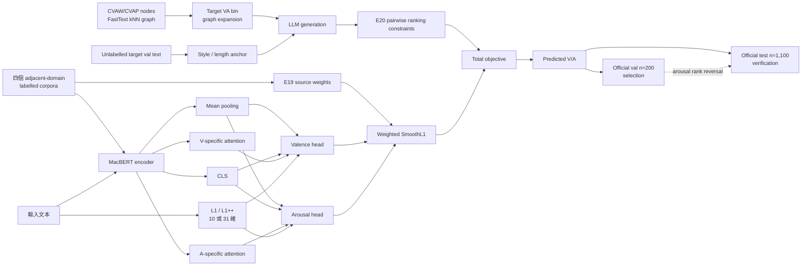

# 論文可寫發現：從「方法增益」改寫為「可靠評估 + 機制診斷」

本文件依 `RESULTS_SUMMARY.md`、官方 val/test 分數、模型逐筆預測、L1 詞典、
情感圖譜與六組生成資料重算。可重現程式為：

```bash
cd baseline
python analyze_paper_evidence.py
```

完整機器可讀結果在 `outputs/analysis/paper_evidence.json`。

## 1. 最重要的判斷：可以從 val 切入，但不能把 val 當成「方法有效」的證據

最穩健的主軸不是「E4/E19 比 baseline 好」，而是：

> 在零 target-domain 標籤、official validation 僅 200 篇的條件下，
> arousal 的 validation ranking 不足以支持模型選擇；多個看似合理的介入在
> validation 上改善，卻在 1,100 篇 test 上消失或反轉。相較之下，
> valence 在不同 split 與系統間都相對穩定。

這不是退而求其次。現有資料對這個主張的證據比對「某模組提升 0.01」強：

- 五個同時有 val/test 分數的系統，A-PCC 排名 Spearman \(\rho=-0.55\)。
- E19 是 val A-PCC 最高的系統（0.452），卻是 test 最低（0.3566）。
- RoBERTa-large 在 val 為 0.407，test 反而最高（0.39）。
- E4 五顆 seed 的 test A-PCC 是 \(0.372\pm0.004\)，顯示模型訓練隨機性很小；
  問題主要不是「剛好抽到壞 seed」。
- E4 與 E19 的 val 差距只有 0.026，而 proxy bootstrap 的 n=200 A-PCC
  95% CI 寬度為 0.193。應寫成「差距只占 CI 寬度約 13.5%」，不要把 CI 寬度
  直接當標準差做顯著性宣稱。
- valence 在各系統的 val/test PCC 約 0.86–0.88，沒有 arousal 的大幅排序反轉。

因此 val 最好的用法是「重建當時為什麼會選錯模型」，而不是再從 val 找一個最好看的數字。

### 安全與不安全的論文措辭

| 可安全主張 | 不應主張 |
|---|---|
| E4 在 validation 改善四項指標 | E4 已證明優於 no-L1 |
| E19 在 validation 上被選為提交模型 | source-aware loss 有效 |
| validation 的 arousal 排名未轉移到 test | test 證明所有方法完全相等 |
| 在目前解析度與 seed 數下，差異不可分辨 | 方法永遠不可能有效 |
| 圖擴散顯著改善種子連貫度與多樣性 | 圖譜提升下游預測 |

## 2. 建議的三層貢獻

### 貢獻一：dimension-dependent evaluation reliability

同一個 shared-task protocol 對 valence 足夠穩定，對 arousal 卻不穩定。
這比單純說「validation 太小」更具體：可靠度問題是 dimension-dependent，
而非所有指標一概不可信。

可寫的結果句：

> Model selection was stable for valence but unreliable for arousal:
> validation and test arousal rankings were negatively correlated
> (\(\rho=-0.55\)), whereas valence PCC remained near 0.87 across systems
> and splits.

### 貢獻二：intrinsic control 不等於 downstream utility

圖譜不是「沒做事」。重算顯示：

| 圖譜統計 | 數值 |
|---|---:|
| 節點 / 邊 | 7,761 / 46,536 |
| connected components | 1 |
| 平均度 / median degree | 11.99 / 10 |
| density | 0.00155 |
| average clustering coefficient | 0.405 |
| 邊 cosine similarity（mean） | 0.882 |
| Valence assortativity | 0.349 |
| Arousal assortativity | 0.299 |
| 相鄰詞平均 V 差 / 隨機詞對 | 1.394 / 1.924（少 27.6%） |
| 相鄰詞平均 A 差 / 隨機詞對 | 1.286 / 1.590（少 19.1%） |

這代表 FastText kNN 圖同時捕捉到語義與一定程度的 affective homophily，
但 arousal homophily 比 valence 弱，與最終 arousal 較難的現象一致。
這是相關性解釋，不應寫成因果。

以目前實際預設的 20 seeds、10 trials × 5 bins 重算：

| seed strategy | coherence mean | 50 次相異 seed sets |
|---|---:|---:|
| random | 0.00158 | 50 |
| VA lookup（C） | 0.01263 | 5 |
| graph expansion（E） | 0.17905 | 50 |

圖擴散相對 lookup 提升約 **14.2 倍** coherence，而且從每個 bin 固定一組詞，
變成 50/50 相異集合。舊文件的 15.8 倍來自先前統計設定；論文若要引用，
應統一改成由現行程式可重現的 14.2 倍，或清楚寫出另一設定。

但下游結果是 C \(0.370\pm0.017\) → E \(0.373\pm0.012\)，只增加 0.003。
因此最有價值的發現是：

> The graph substantially improved the intrinsic coherence and diversity of
> generation controls, but this improvement did not transfer to downstream
> arousal ranking.

這是一個完整的「mechanism succeeded, task utility did not」分析，而不是只報 negative result。

### 貢獻三：domain-form alignment 比 graph topology 更重要

生成資料的結果可分成三層：

1. N→A：0.353→0.367（+0.014），顯示 prompt 中加入任意種子詞有小幅作用。
2. A→C：0.367→0.370（+0.003），VA-aware lookup 相對隨機種子沒有可測增益。
3. C→E：0.370→0.373（+0.003），圖 topology 同樣無可測增益。
4. E→F2：0.373→0.387，style anchor + length matching 的組合有較大的內部增量，
   但 F2 與無增強 baseline 的差距仍只有 +0.015，且 A-MAE 由 0.928 惡化至 1.037。

長度分布提供更直接的 domain-alignment 證據：

| 資料 | 長度 mean±std | min–max | KS↓ vs real val | Wasserstein↓ |
|---|---:|---:|---:|---:|
| real val | 73.7±32.4 | 23–226 | — | — |
| C | 83.2±8.3 | 60–108 | 0.590 | 22.08 |
| E | 83.7±10.3 | 58–111 | 0.595 | 20.53 |
| F | 82.9±10.8 | 59–110 | 0.518 | 20.52 |
| F2 | 57.9±21.5 | 3–161 | **0.293** | **15.77** |

F2 的 KS 約減半，說明 prompt-level length/style alignment 確實改變資料分布；
但它過度產生短文（31.5% <50 字，real val 僅 6%），又幾乎不產生長文
（0.5% >120 字，real val 為 8.5%）。可以寫成「改善但未完全對齊」。

## 3. 圖譜實際長什麼樣：可用案例

### 局部鄰域是合理的

- 「開心」鄰居包括「蠻開心、挺開心、好開心、很開心、格外開心」，
  cosine weights 約 0.89–0.95，VA 也大致相近。
- 「平靜」鄰居包括「平平靜靜、異常平靜、風平浪靜、寧靜、平穩」；
  多數 A 約 1.4–3.4，符合低 arousal。
- 「憤怒」鄰居包括「忿怒、震怒、惱怒、憤慨、眾怒、悲憤」；
  多數 A 約 7.0–8.2。
- 「疲憊」鄰居包括「疲倦、疲弱、昏昏沈沈、疲乏、疲勞」；
  多數 A 約 3.4–4.0。

### 但局部也有 semantic-only edge noise

「焦慮」的鄰居中包含「欣慰」（cosine 0.819；V=6.2, A=4.6）。
這說明 FastText 邊首先是語義/使用脈絡相似，不保證 VA 完全一致。
整體 arousal assortativity 只有 0.299，也量化了這個限制。

### lookup 與 graph seed 的實例

負面高 arousal 的 lookup 會選：

> 超幹、幹、狂暴、狂躁、呼天搶地、怒吼、殘暴、罪大惡極、王八蛋……

graph expansion 的一個集合則是：

> 哭喊、仇敵、變心、奪取、仇恨、哭訴、欺負、狠心、憂心、欺侮……

中性高 arousal 的 lookup 含「更沒有強姦」等詞典/斷詞垃圾；
graph expansion 則形成「驚呆、驚駭、驚歎、驚慌、驚嚇、驚愕」群。

這些案例能證明 graph 改善 prompt seed 的可讀性與語意連貫性；
但 test 結果同時告訴我們，LLM 可能已能從情緒描述吸收/修正 seed noise，
所以 seed 品質沒有成為下游瓶頸。

## 4. L1：不要寫成有效模組，改寫成「高覆蓋但高度冗餘」

### 10 維特徵定義

令文本分詞為 \(t_1,\dots,t_T\)，命中的詞典集合為 \(H\)，詞典 VA 已正規化至
\([0,1]\)。L1 特徵為：

\[
\mathbf l(x)=
\left[
\frac{|H|}{T},
\frac{\min(|H|,20)}{20},
\mu(V_H),\max(V_H),\min(V_H),\sigma(V_H),
\mu(A_H),\max(A_H),\min(A_H),\sigma(A_H)
\right].
\]

沒有命中時，VA 統計設 0.5、std 設 0。融合為：

\[
\hat{\mathbf y}
=\sigma\!\left(
W[\operatorname{MeanPool}(H_{\text{BERT}});\mathbf l(x)]+b
\right).
\]

### 新的診斷數據

| split | 至少一詞命中 | mean token coverage |
|---|---:|---:|
| train | 96.44% | 15.75% |
| official val | 100% | 15.86% |
| official test | 99.82% | 15.59% |

這表示 L1 的失敗不是 OOV/覆蓋不足。更可能的解釋是：

- MacBERT 已編碼多數常見情緒詞，手工聚合訊號高度冗餘。
- 詞典會命中「好、想、對、沒有」等廣泛詞，coverage 高不等於訊號精準。
- 文件級 mean/max/min/std 忽略否定、對象、轉折與事件脈絡。

三 seed ensemble 的逐筆 test 預測顯示：

| 比較 | V prediction corr | A prediction corr | A mean abs change | A std |
|---|---:|---:|---:|---:|
| L1 vs no-L1 | 0.9977 | 0.9771 | 0.135 | 0.737 vs 0.737 |

L1 幾乎不改變 arousal prediction spread，只把 arousal 平均值降低約 0.056；
這更像小幅 calibration shift，而不是有效 reranking。它也吻合官方結果：
V-PCC 都是 0.870，A-PCC 僅 0.372 vs 0.363，差距小於 no-L1 seed std 0.021。

### 可放入 qualitative analysis 的例子

`C87_16`：

> 感謝他帶我回來台灣生活……婆婆人也不錯……目前滿意這個台灣老公。

命中「感謝(5.6)、在乎(4.4)、適應(4.0)、不錯(4.4)、滿意(5.6)」等
arousal 偏中低詞。L1 ensemble 把 A 從 no-L1 的 5.287 降到 4.749。
這個方向在語意上可解釋，但因 test gold 未公開，不能稱為「預測更正確」。

## 5. E19、E20、E21 的公式、行為與應有解讀

共同先將標籤正規化：

\[
\tilde y_d=\frac{y_d-1}{8},\qquad
\hat y_d=\sigma(z_d),\qquad d\in\{V,A\}.
\]

基礎 SmoothL1 記為
\(\ell_\delta(\hat y,y)\)，程式採 PyTorch 預設 \(\beta=1\)。

### E19：source-aware weighted regression

對來源 \(s_i\) 的樣本：

\[
\mathcal L_{\text{E19}}
=\frac{1}{2B}\sum_{i=1}^{B}
\left[
w_V^{(s_i)}\ell_\delta(\hat v_i,\tilde v_i)
+w_A^{(s_i)}\ell_\delta(\hat a_i,\tilde a_i)
\right].
\]

所有 \(w_V=1\)；arousal 權重為：

| source | \(w_A\) |
|---|---:|
| CVAS sentence | 0.25 |
| CVAT text | 0.50 |
| ROCLING-2021 education | 0.75 |
| DSA-MST reflection | 1.00 |
| raw augmentation | 0（其 valence 為 0.25） |

E19 相對 E18 的逐筆 test 行為：

- A prediction correlation 0.9915。
- mean absolute A change 只有 0.077。
- A spread 由 0.714 增至 0.730。
- 官方 A-PCC 反而由約 0.370 降至 0.3566。

因此 E19 的合理結論是「source weighting 只造成小幅 prediction perturbation，
val 上的 0.044 A-PCC 優勢沒有轉移」，不是「source-aware 有效」。

例子 `V454_13` 描述「內心平靜、舒適、安然、沒有壓力」。
E19 預測 A=4.014，E18 為 3.725；source weighting 反而提高此低 arousal 文本。
這顯示它不是簡單的全域縮放，而是改變 learned representation；仍因無 gold
而不能判定哪個值正確。

### E20：synthetic pairwise ranking-only loss

對 synthetic batch 中滿足
\(\tilde y_i-\tilde y_j\ge g\) 的 ordered pairs：

\[
\mathcal L_{\mathrm{rank}}^d
=\frac{1}{|\mathcal P_d|}
\sum_{(i,j)\in\mathcal P_d}
\max\left(0,m-(\hat y_i^d-\hat y_j^d)\right).
\]

程式使用 \(m=0.125\)（原量尺 1 分）、\(g=0.1875\)（原量尺 1.5 分），總 loss：

\[
\mathcal L_{\text{E20}}
=\mathcal L_{\text{E19}}
+0.10\mathcal L_{\mathrm{rank}}^A
+0.05\mathcal L_{\mathrm{rank}}^V.
\]

重要命名釐清：E20 是 ranking objective，不等於 graph 本身；
它使用的 synthetic CSV 來自生成管線，但公式沒有圖結構項。

E20 相對 E19：

- test A prediction correlation 0.9751。
- mean absolute A change 0.132。
- A spread 0.730→0.750，符合 ranking loss 拉開輸出的設計。
- test A-PCC 0.3566→約 0.370，但仍未超過 E4 0.372，A-MAE 約 0.93。

`V430_13` 同時有「蠻開心」和「蠻緊張」，E20 將 A 從 5.543 拉至 6.099；
`V413_13` 描述日常例行與「平常心」，E20 將 A 從 3.722 降至 3.195。
這兩例顯示 ranking loss 學到較大的 contrast，但 aggregate test PCC 沒有突破。

### E21：dimension-specific attention

對 token hidden states \(\mathbf h_t\)，每個 dimension \(d\) 有獨立 attention：

\[
e_{d,t}=\mathbf u_d^\top\tanh(W_d\mathbf h_t+\mathbf b_d)+c_d,
\]

\[
\alpha_{d,t}
=\frac{\exp(e_{d,t})}
{\sum_{k:m_k=1}\exp(e_{d,k})},
\qquad
\mathbf p_d=\sum_t\alpha_{d,t}\mathbf h_t.
\]

各 head 的輸入為：

\[
\mathbf r_d=
[\operatorname{MeanPool}(H);\mathbf h_{\mathrm{CLS}};\mathbf p_d;\mathbf l_{31}(x)],
\qquad
\hat y_d=\sigma(W_d^{\text{head}}\mathbf r_d+b_d^{\text{head}}).
\]

checkpoint 的 head input 是 2335 維，正好是 \(3\times768+31\)，所以實際 E21
使用 31 維 intensity features；`RESULTS_SUMMARY.md` 原本的「無 L1」是錯的，
已修正。另一個要注意的點是：

- `e21_dim_attention`：dim-attention + intensity + source-aware。
- `e21_dim_attention_rank_aug`（E21b）：再加 ranking。
- 表中 0.638/0.865/0.923/0.394 對應 E21b，不應標成純 E21。

純 E21 沒有官方 test scalar。它在 internal dev 的
V-MAE/V-PCC/A-MAE/A-PCC 為 0.481/0.817/0.833/0.617；
與 E19 的 0.478/0.821/0.823/0.618 幾乎相同，沒有證據支持 attention 優勢。

在 official val 的 label-free predictions 中，純 E21 相對 E19：

- A prediction correlation 0.9250。
- mean absolute A change 0.269。
- A spread 0.727→0.790。

所以 E21 是四者中真正大幅改變 prediction geometry 的設計，但現有有標籤 proxy
沒有顯示效能提升。若要做 interpretability，需重新推論輸出 \(\alpha_{V,t}\)、
\(\alpha_{A,t}\)；目前 CSV 只有最終分數，不能事後宣稱 attention 看到了哪些詞。

## 6. 全部實驗可提煉出的結果

| 實驗群 | 數據告訴我們什麼 | 論文角色 |
|---|---|---|
| EmoBank→加入反思語料 | val MAE 改善，但 A-PCC 不單調 | domain-adjacent data 不是 arousal 保證 |
| E4 L1 | val 四指標改善，test 消失 | 最具說服力的 selection reversal |
| DAPT | val 無改善 | 只有 200 篇 target text 的 MLM 訊號不足 |
| E18 intensity | test 幾乎等於 E4 | 手工 cue 沒有額外資訊 |
| E19 source-aware | val 最佳、test 最差 | 核心 model-selection failure |
| E20 ranking | spread 增加但 test 不超過 E4 | geometry 改變不等於 ranking 提升 |
| E21 attention | prediction 改變最大，dev 無提升 | pooling 不是主要瓶頸 |
| multi-seed ensemble | val/test 都沒有明顯突破 | 問題不是單模型 variance |
| multi-encoder | RoBERTa-large val 差、test A 最好 | 再次支持 val ranking 不可靠 |
| teacher pseudo-label | 目前只有 val 主張 | 無 test scalar 前不宜下結論 |
| KG ladder | intrinsic control 成功、下游失敗 | 最完整的機制消融 |
| no-L1 | test 與 L1 不可分辨 | 高覆蓋但冗餘的詞典訊號 |

## 7. 建議流程圖



若放入論文正文，建議拆成兩圖：方法圖只畫到 `Predicted V/A`；
結果圖用現有 val-vs-test scatter 表現 reversal，避免單張圖資訊過多。

## 8. 建議論文敘事與標題

主張順序：

1. 我們建立 E4 並依 val 逐步加入 source-aware、ranking、attention、graph generation。
2. 這些方法確實改變了預期的中介量：graph coherence、seed diversity、
   prediction spread、length distribution。
3. 但中介量改善沒有轉成 test 效能，甚至 validation ranking 反轉。
4. 多 seed、no-L1、controlled augmentation ladder 排除了單一 seed 與單一模組偶然性。
5. 結論是此設定下的 bottleneck 在 target-domain arousal supervision 與評估可靠度，
   而非模型容量、pooling 或詞典 coverage。

可考慮的標題：

- **When Better Controls Do Not Yield Better Predictions: Validation Instability in Chinese Arousal Regression**
- **Intrinsic Success, Downstream Failure: Diagnosing Graph-Guided Augmentation for Chinese Dimensional Sentiment**
- **The Validation Mirage: Why Arousal Improvements Fail to Transfer in Zero-Label Domain Adaptation**

三條 contribution 可直接改寫為：

1. We quantify a dimension-specific validation–test reliability gap, with stable
   valence but negatively correlated arousal rankings.
2. We separate intrinsic controllability from downstream utility: graph expansion
   improves seed coherence by 14.2× and diversifies all sampled seed sets, yet adds
   only 0.003 test A-PCC over lookup.
3. Through a multi-seed component ladder, we show that target-style/length alignment
   affects synthetic distribution more than graph topology, while all augmentation
   variants retain a calibration cost.

## 9. 還能補強、但不應用現有數據假裝已有的證據

優先順序：

1. **補 F 的 s1/s2 官方分數**：才能把 style anchor 與 length matching 拆開。
2. **E21 attention export**：在 forward 中保存 \(\alpha_{V,t},\alpha_{A,t}\)，
   報 token-level overlap、entropy，以及 V/A attention divergence，再做真正案例分析。
3. **L1 interaction analysis（需 gold）**：目前只能看 prediction change。
   若未來取得 gold，可依 coverage quartile 比較 L1/no-L1 error difference，
   才能回答「L1 在哪些文本有效」。
4. **多重比較校正**：論文應承認多輪 adaptive leaderboard selection；
   若要報 val 顯著性，應用 bootstrap paired difference 並考慮多重嘗試，
   不要只報單一 PCC 點估計。

總結一句：這批資料不支持「我們的方法在 test 顯著提升」，但非常支持一篇
有完整機制驗證的診斷型論文——圖、ranking、attention 都成功改變了它們被設計要改變的
中介訊號，真正失敗的是「這些 proxy 能否代表 target test arousal」這個假設。
