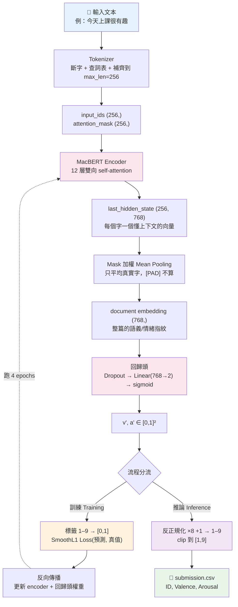

# 訓練 / 推論流程圖 (Pipeline)

DSA-NIDF：文本 → MacBERT encoder → embedding → 回歸頭 → valence / arousal (1–9)。

模型：`hfl/chinese-macbert-base`（hidden size = 768）。
共同骨幹（① → ⑤）訓練與推論完全相同，只在尾端分流。

---

## 整體流程圖



---

## 訓練流程（含真實數值範例）

輸入：`"今天上課很有趣"`，標籤 `valence=7.0, arousal=6.0`

```
① 文本 + 標籤
② Tokenizer → [CLS] 今 天 上 課 很 有 趣 [SEP] [PAD]…   input_ids(256,) + attention_mask(256,)
③ 標籤正規化 1–9 → [0,1]:  valence (7-1)/8 = 0.750 ; arousal (6-1)/8 = 0.625
④ Encoder → last_hidden_state (256, 768)
⑤ Mask 加權 mean pooling → embedding (768,)
⑥ 回歸頭 Dropout→Linear(768→2)→sigmoid → 預測 (0.72, 0.61)
⑦ SmoothL1((0.72,0.61),(0.750,0.625)) → 反向傳播 → 更新 encoder + head
   （整個 train.csv 跑 4 epochs，每步微調；以 mean(PCC)−mean(MAE) 選最佳 epoch）
```

## 推論流程（產生 submission）

輸入：無標籤文本，例 `M633_16: "我的朋友及兒子，與他們分享…"`

```
①–⑤ 同訓練（torch.no_grad，不更新權重）
⑥ 回歸頭 → sigmoid → (0.70, 0.45)
⑦ 反正規化:  valence 0.70*8+1 = 6.6 ; arousal 0.45*8+1 = 4.6 → clip[1,9]
   寫入 submission.csv:  M633_16, 6.6000, 4.6000
```

---

## 維度對照表

| 階段 | 張量 / 數值 | 形狀 |
|------|------------|------|
| Tokenizer 輸出 | input_ids / attention_mask | (256,) |
| Encoder 輸出 | last_hidden_state | (256, 768) |
| Pooling 後 | document embedding | (768,) |
| 回歸頭輸出 | (v', a') ∈ [0,1] | (2,) |
| 反正規化後 | (Valence, Arousal) ∈ [1,9] | (2,) |

> **直覺**：encoder 負責「讀懂文本、壓成一個語義向量」，回歸頭負責「把向量翻譯成兩個情緒分數」，
> 兩者一起微調，使翻譯越來越準。`granularity` 等欄位只是 metadata，**模型訓練時看不到**。
