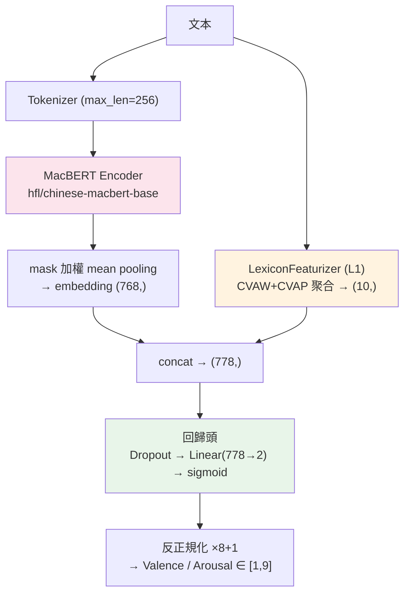
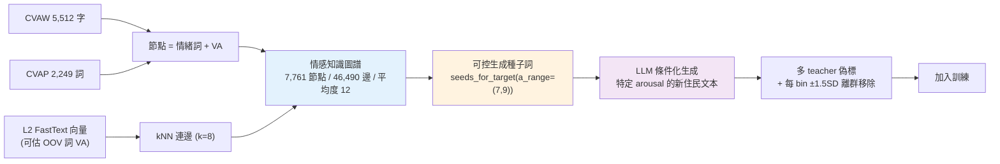

# 方法與架構 — DSA-NIFT @ ROCLING 2026

## 1. 主線模型



- **標籤正規化**：1–9 → [0,1]，sigmoid 輸出，推論反轉（收斂較穩）。
- **Pooling**：attention mask 加權 mean pooling。
- **Loss**：SmoothL1（對離群穩健），V/A 聯合優化。
- **Early-stop**：`mean(PCC) − mean(MAE)`，對齊官方四指標的方向。
- **消融旋鈕**：`--no_lexicon` 關掉 L1。

---

## 2. 三層情感資源 L1 / L2 / L3

```
CVAW + CVAP（原始 字/詞 VA 詞典，7,761）
   │  L2：FastText(char n-gram) + SVR 學「詞向量 → VA」→ 覆蓋率擴充到 OOV 詞
   ▼
擴充版 VA 詞典 / 詞向量
   ├─ L1：對文本聚合情緒詞 VA → 10 維特徵 → concat 進回歸頭   ★唯一直接進模型
   └─ L3：把詞連成圖 → 可控生成 → 合成資料補 arousal          ★資料層創新
```

| 層 | 檔案 | 產出 | 角色 | 直接影響分數 |
|---|---|---|---|---|
| **L1** | `lexicon.py` | 10 維特徵 | 詞典特徵融合（**實驗 4**） | ✅ 直接 |
| **L2** | `word_va_regressor.py` | `outputs/l2_word_va.pkl`（~814MB） | 詞→VA 迴歸，無限覆蓋，餵 L3 | ❌ 基礎設施 |
| **L3** | `affective_graph.py` | `outputs/l3_graph.pkl`（~1.8MB） | 情感知識圖譜 | ⭕ 間接（供生成） |
| **增強** | `augment_generate.py` | `data/train_aug.csv`（400 篇） | 可控生成補 arousal 分布 | ⭕ 間接 |

### L1：詞典特徵（10 維）
對每篇文本掃 CVAW+CVAP 詞典命中的情緒詞，聚合成
**coverage / count / valence 的 mean·max·min·std / arousal 的 mean·max·min·std**。
目的：給模型一個顯性的「這篇有哪些高/低喚醒詞」訊號，直攻 arousal。

### L3：情感知識圖譜

- 節點 = CVAW/CVAP 情緒詞（帶 VA）；邊 = 用 L2 FastText 向量做 kNN（k=8）。
- 驗證過的行為：`焦慮 → 焦躁 / 憂慮`；高 arousal 種子詞 `狂喜 / 怒吼 / 煎熬`。

---

## 3. 變體（`train_v2.py` 的旋鈕）

`train.py` 已**凍結**（實驗 1–5b 可復現）；後續全部改用 `train_v2.py`，
其**預設參數即復現實驗 4**。

| 旋鈕 | 說明 | 實驗 |
|---|---|---|
| `--seed` / `--model` | multi-seed / 換 encoder | E10 / E11 |
| `--lex_mode l1 \| l1_intensity \| l1l2` | 10 維 / 31 維（`lexicon_intensity.py`）/ 16 維（`lexicon_l2.py`） | E4 / E18 / E16 |
| `--source_aware` | 依 `granularity` 對 V/A loss 加權 | **E19** |
| `--source_weights` | 自訂上述權重 | 未跑 |
| `--rank_aug <csv>` | 合成資料只進 pairwise hinge、不進 SmoothL1 | E20 |
| `--pooling mean_cls_dim_attention` | mean + CLS + V/A 各自 attention pooling | E21 |
| `--extra_train <csv>` | 額外訓練資料（偽標） | E13 |
| `--arousal_weight` / `--pcc_weight` / `--mae_weight` | loss 配比 | E15（未跑） |

### `--source_aware` 的權重（E19）
arousal 對 domain shift 敏感 → 通用情緒庫降權；valence 權重全部 1.0。

| granularity | V 權重 | A 權重 |
|---|---|---|
| `sentence`（CVAS） | 1.0 | 0.25 |
| `text`（CVAT） | 1.0 | 0.5 |
| `reflection`（DSA-MST） | 1.0 | 1.0 |
| `edu2021` | 1.0 | 0.75 |

---

## 4. 輔助工具

| 檔案 | 用途 |
|---|---|
| `prepare_data.py` | 合併所有來源 → `data/train.csv` / `dev.csv` / `val_unlabeled.csv` |
| `download_external.sh` | 下載外部語料（DSA-MST） |
| `dapt.py` | 領域適應續訓（MLM），實驗 2 |
| `ensemble.py` | dimension-wise weighted / mean 融合（V、A 分開權重） |
| `build_pseudo_labels.py` | multi-teacher 逐篇偽標 + 分歧過濾 + 每 bin ±1.5SD 離群移除 |
| `embed_regressor.py` | frozen embedding + SVR/Ridge（**未跑**） |
| `calibrate.py` | arousal 後校準，網格搜尋 scale/shift（**只改 MAE，PCC 不變**，**未跑**） |
| `build_silver_pairs.py` | 對官方無標籤文本抽 pair，LLM pairwise 判斷 VA 相對高低 |
| `eval_silver_ranking.py` | 算各 run 的 pairwise ranking accuracy |
| `fetch_results.py` | 解 Colab 下載的 `*_results.zip`；`--pack <run>` 打包成可上傳的 `submission.csv.zip` |

## 5. 統一輸出格式

```
outputs/preds/{run}_dev.csv : ID,valence_true,arousal_true,valence_pred,arousal_pred,model_name,split
outputs/preds/{run}_val.csv : ID,valence_pred,arousal_pred,model_name,split
outputs/{run}_submission.csv: ID,Valence,Arousal   （官方格式）
outputs/{run}_best.pt       : 權重（teacher / 重跑推論用，務必保留）
```
ensemble 的輸出也寫回 `outputs/preds/`，所以可以疊 ensemble 或再接 `calibrate.py`。
