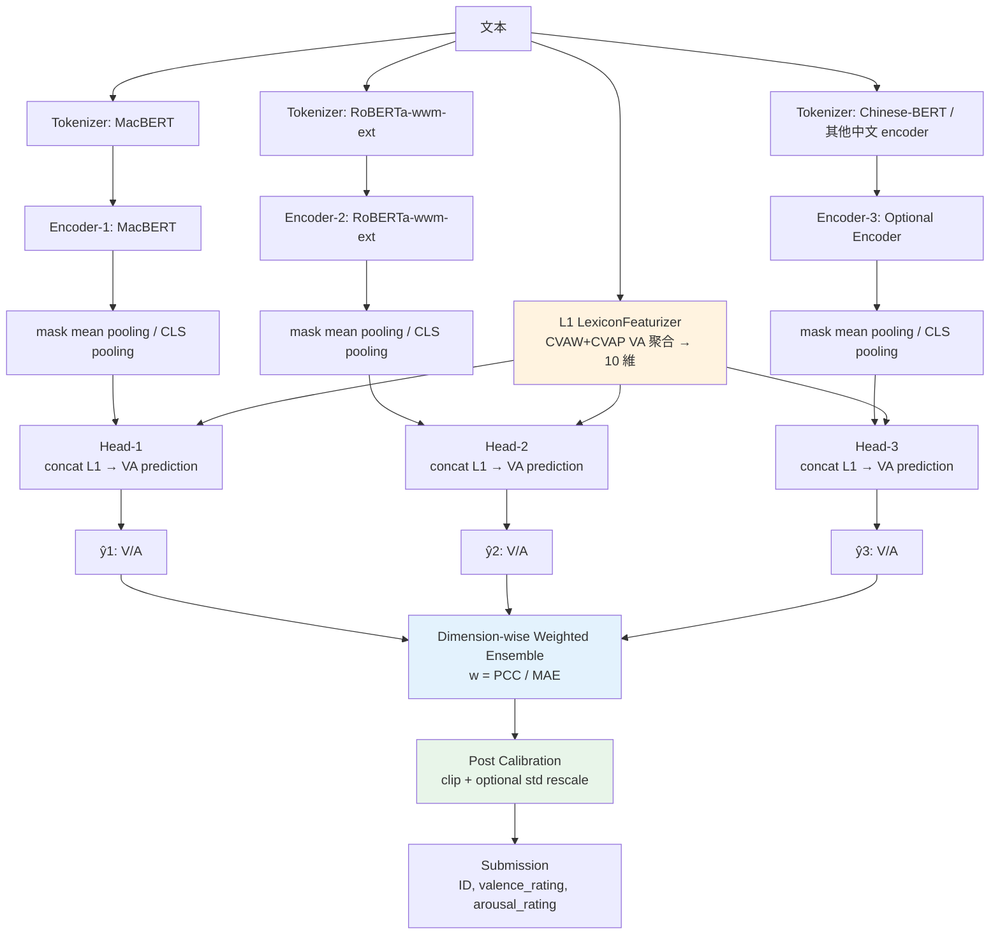
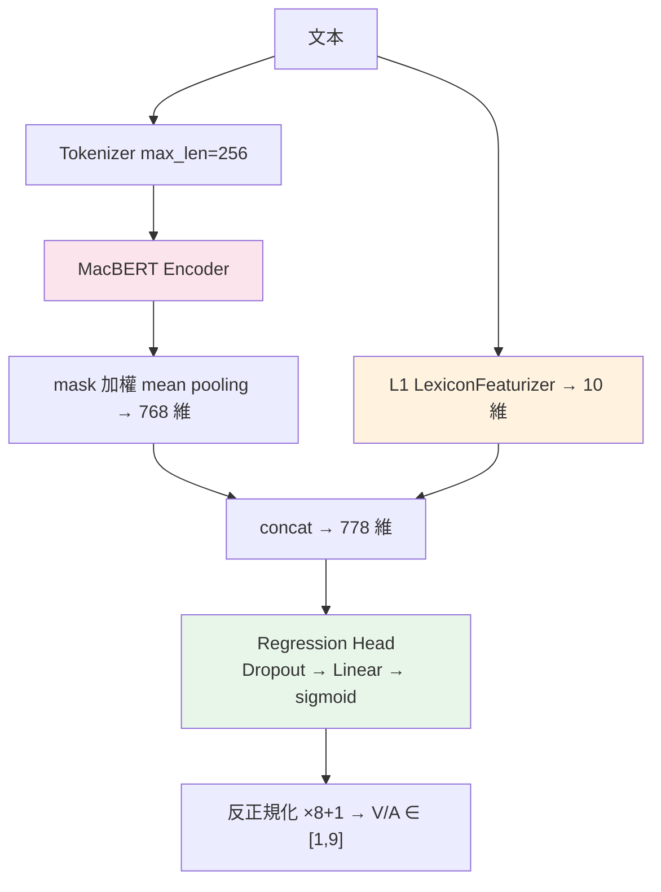
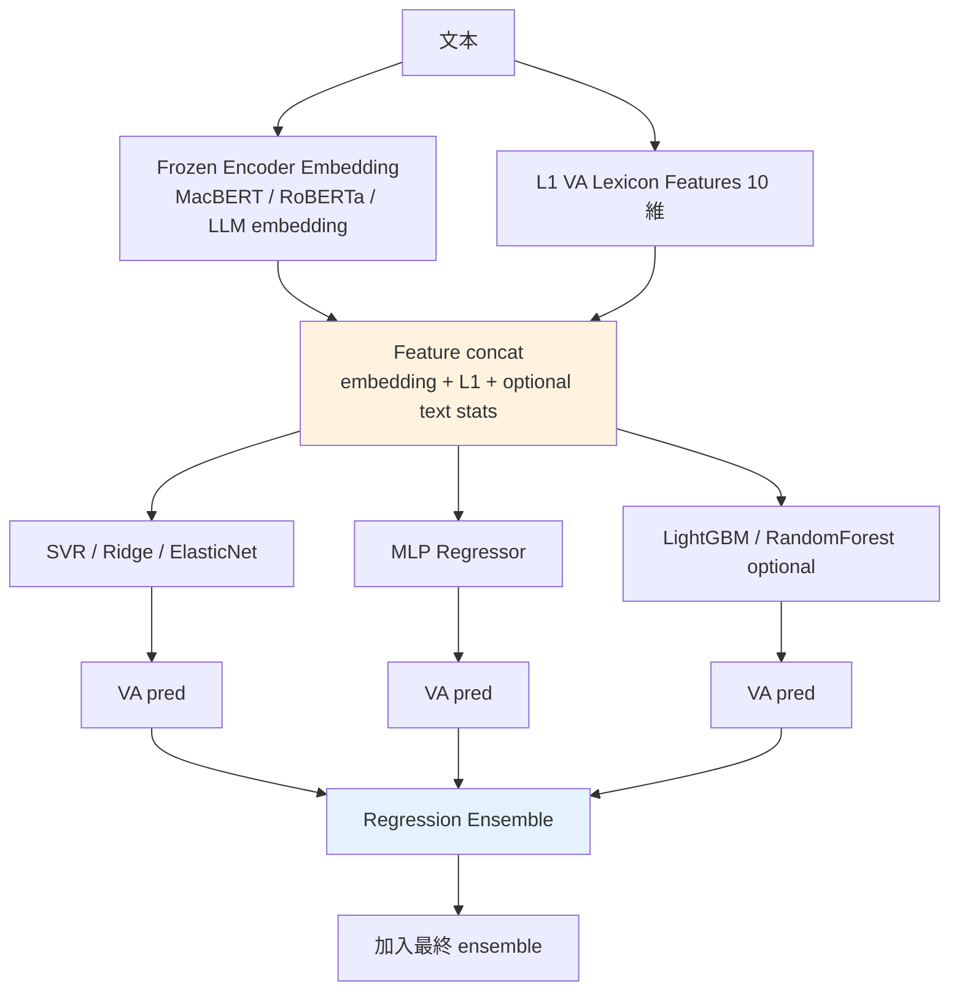
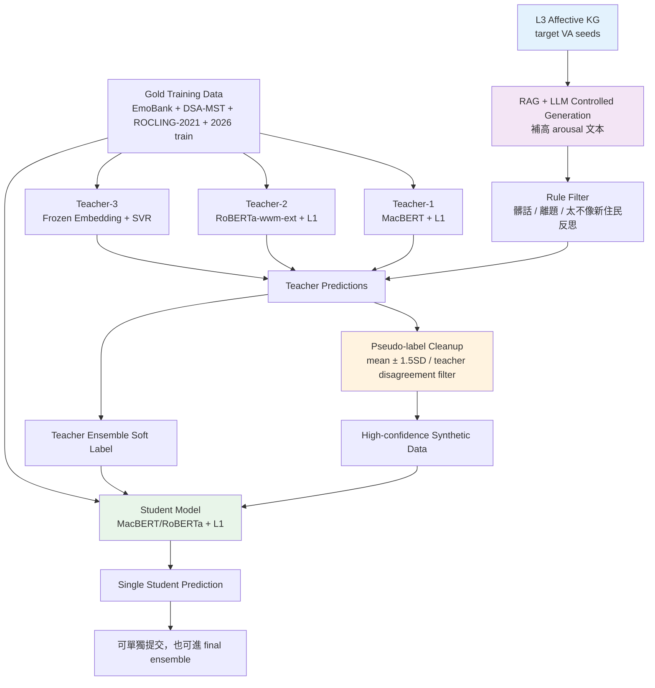
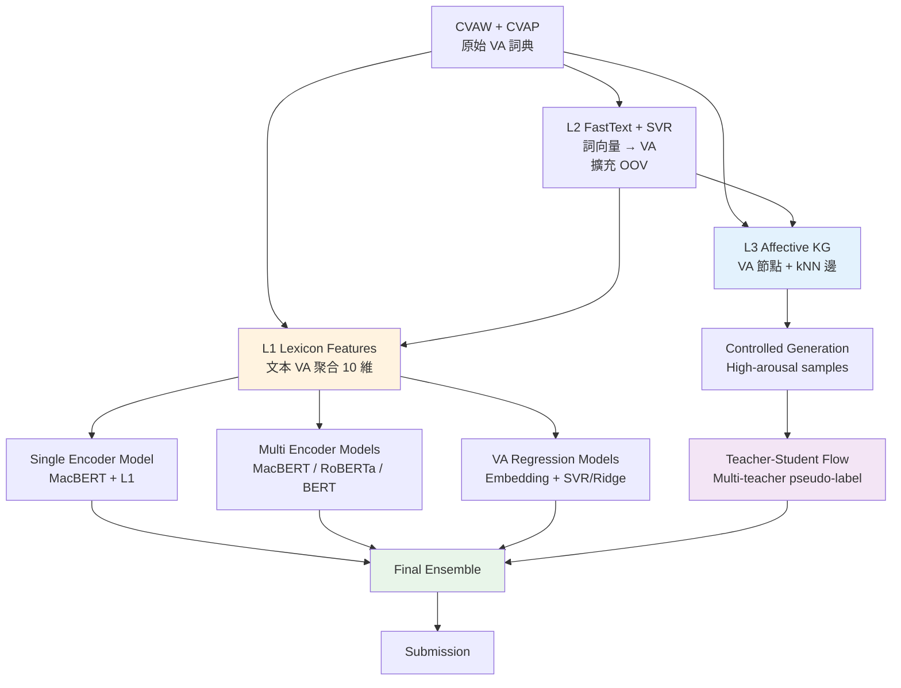
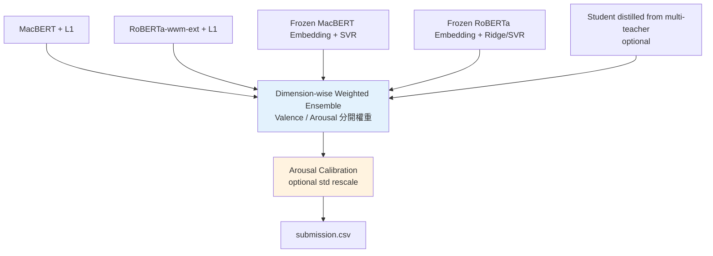

# DSA-NIDF Pipeline v2 — 加入 Encoder Ensemble / VA Regression / Teacher-Student Flow

任務：對新住民自我反思文本預測 **valence / arousal**，輸出 1–9 實數。
評分：Valence / Arousal 各算 **MAE(↓)** 與 **PCC(↑)**，最後看 4 指標 mean rank。
目前瓶頸：**arousal PCC 約 0.39，模型預測有壓縮現象，std 偏小。**

本版在原本的 **L1 詞典融合 + L2 詞向量 VA 擴充 + L3 情感知識圖譜生成** 上，新增三條比較可行的拿分路線：

1. **Encoder Ensemble**：多個中文 encoder 各自微調，再用 dev 表現加權融合。
2. **VA Regression Ensemble**：把 encoder / LLM embedding 當 frozen feature，丟給 SVR / Ridge / MLP 等回歸器。
3. **Teacher-Student / Distillation Flow**：用多 teacher 產生穩定偽標，再訓練單一 student，特別讓 L3 生成資料能更安全地進訓練。

---

## 1. 任務背景與設計重點

DSA 任務的核心不是單純判斷正負面，而是把文本映射到連續的 **VA 空間**：

- **Valence**：情緒正負向，1 越負面，9 越正面。
- **Arousal**：喚醒程度，1 越平靜，9 越激動。

這次 ROCLING 2026 的文本是新住民自我反思，跟醫療反思、學生自評類似，都有幾個麻煩點：

- 情緒常常是隱性的，不一定直接說「我很焦慮」。
- Valence 通常比 arousal 好學，因為正負面詞比較明顯。
- Arousal 容易被模型預測到中間值，造成 **PCC 低、std 壓縮**。
- 因為評分同時看 MAE 和 PCC，所以只把預測壓到平均附近雖然 MAE 可能不差，但 PCC 會爆掉。

因此，本 pipeline 的設計重點是：

> 保住 valence 的穩定 MAE / PCC，同時用詞典、ensemble、偽標資料和 distillation 補 arousal 的排序能力。

---

## 2. 主線模型架構 v2：L1 + 多 Encoder + Ensemble



### 2.1 原本單模型仍然保留

原本的 L1 詞典融合模型不丟掉，因為它是目前最直接、最乾淨的主線：



目前這條線的角色：

- 是所有後續實驗的 **strong baseline**。
- 可直接產 submission。
- 可被 ensemble 當其中一個 model。
- 可被 teacher-student flow 當 teacher 或 student。

---

## 3. 新增模組 A：Encoder Ensemble

### 3.1 做法

各 encoder 獨立 fine-tune，最後只融合輸出分數：

```text
MacBERT + L1          → pred_macbert.csv
RoBERTa-wwm-ext + L1  → pred_roberta.csv
Chinese-BERT + L1     → pred_bert.csv
Frozen Embedding SVR  → pred_svr.csv

最後：
Valence_final = Σ w_model,valence × pred_model,valence
Arousal_final = Σ w_model,arousal × pred_model,arousal
```

權重建議不要用同一組，而是 **valence / arousal 分開算**：

```text
score_m,d = max(PCC_m,d, 0) / (MAE_m,d + eps)
w_m,d = score_m,d / Σ score_m,d
```

其中：

- `m` 是 model。
- `d` 是 valence 或 arousal。
- `eps = 1e-6`，避免除以 0。
- 如果某模型 arousal PCC 很爛，就不要讓它在 arousal 維度亂投票。

### 3.2 為什麼適合目前瓶頸

Arousal PCC 低通常代表模型不會排順序，只會往中間縮。不同 encoder 對語氣、詞彙、句型、長文本細節的敏感度不同，ensemble 有機會讓排序穩一點。

尤其可以讓：

- MacBERT 保住中文語意與 valence。
- RoBERTa-wwm-ext 補另一種 encoder bias。
- Frozen embedding + SVR 補「非神經 head」的分數分布。
- L1 詞典特徵在每個 encoder 都可共用，避免純 BERT 把顯性 VA 詞吃掉但沒有好好用。

### 3.3 實作建議

新增：

```text
scripts/train_multi_encoder.py
scripts/predict_dev.py
scripts/ensemble.py
```

每個模型輸出 dev/test prediction：

```csv
ID,valence_true,arousal_true,valence_pred,arousal_pred,model_name
```

ensemble 腳本讀取多個 prediction 檔，依 dev 指標算權重，再對 test 加權。

### 3.4 可行性 / 創新性

| 項目 | 評估 |
|---|---|
| 可行性 | **高**。幾乎不改主模型，只是多跑幾個 encoder 和一支融合腳本。 |
| 預期拿分 | **中高**。比單模型穩，通常是 shared task 最划算招。 |
| 創新性 | **中低**。方法常見，但在比賽很實用。 |
| 風險 | 如果 dev 太小，權重可能 overfit。建議用 k-fold OOF 或至少固定 seed 多跑。 |
| 優先序 | **很高**，建議排在 L1 後面馬上做。 |

---

## 4. 新增模組 B：VA Regression Ensemble

這條線不是再訓練一個 transformer head，而是把 encoder 當 feature extractor，抽 embedding 後餵傳統回歸器。



### 4.1 建議 feature

```text
[encoder_embedding] + [L1_10dim] + [simple_stats]
```

`simple_stats` 可以很少，不要膨脹：

- text length
- punctuation count
- exclamation/question count
- first-person pronoun count
- high-arousal lexicon count
- negation count

這些特徵對 arousal 可能有用，因為 arousal 不只看正負面，也看強度、焦躁、激動、疑問、驚嘆、重複詞等等。

### 4.2 回歸器建議

| Regressor | 用途 | 備註 |
|---|---|---|
| SVR-RBF | 主力 frozen embedding regression | 小資料常常穩，但要 scale。 |
| Ridge | 強 baseline | 不容易過擬合，可當 ensemble 成員。 |
| ElasticNet | 稀疏化特徵 | 如果加很多手工特徵才比較有用。 |
| MLPRegressor | 非線性補充 | 要小心 overfit。 |
| LightGBM | 可試但非必要 | 資料太少可能不穩。 |

### 4.3 VA Regression 的輸出設計

可以做兩種：

**方案 A：同一模型輸出 V/A**

```text
SVR_valence + SVR_arousal 分開訓練
```

實作最簡單，也比較符合 V/A 其實是兩個相關但不完全相同的連續任務。

**方案 B：先預測 VA，再做校準**

```text
raw_pred → clip(1,9) → optional calibration
```

校準建議只做很保守的：

```text
pred_calibrated = mean_train + scale × (pred_raw - mean_pred_dev)
```

其中 `scale` 不要硬拉太大，先用 dev 找 arousal 的最佳 scale，例如 1.05、1.10、1.15。這是為了修正 arousal 壓縮，但不要把 MAE 炸掉。

### 4.4 可行性 / 創新性

| 項目 | 評估 |
|---|---|
| 可行性 | **中高**。不用改 transformer 訓練，只要能抽 embedding。 |
| 預期拿分 | **中**。單獨未必贏 BERT，但很適合當 ensemble 補位。 |
| 創新性 | **中**。embedding + SVR 是 DSA 相關任務很合理的強 baseline。 |
| 風險 | LLM embedding 若要 API 成本與可重現性要注意；SVR 參數要用 dev/OOF 調。 |
| 優先序 | **高**，適合和 encoder ensemble 並行。 |

---

## 5. 新增模組 C：Teacher-Student / Distillation Flow

這條線主要解決 L3 生成資料的問題：生成文本本身沒有 gold VA label，如果直接拿單一模型標，有機會把錯誤放大。所以更安全的做法是：**多 teacher 偽標 + 離群移除 + student distillation**。



### 5.1 Teacher 設計

建議 teacher 不要都長一樣，否則只是同一種錯誤投三票：

| Teacher | 訓練資料 | 角色 |
|---|---|---|
| T1 MacBERT + L1 | 反思語料 + L1 | 主線 teacher，保 valence。 |
| T2 RoBERTa-wwm-ext + L1 | 同上 | 補不同 encoder bias。 |
| T3 Frozen embedding + SVR | 同上 | 補傳統 regression bias。 |
| T4 optional high-arousal model | 加權高 arousal sample | 專門補 arousal 排序。 |

Teacher 的目的不是每個都超強，而是錯誤不要完全一樣。

### 5.2 Pseudo-label 清理

生成資料 `x_gen` 經多 teacher 預測：

```text
T1(x) = (V1, A1)
T2(x) = (V2, A2)
T3(x) = (V3, A3)
```

平均：

```text
V_mean = mean(V1,V2,V3)
A_mean = mean(A1,A2,A3)
```

不確定性：

```text
V_sd = std(V1,V2,V3)
A_sd = std(A1,A2,A3)
```

保留規則：

```text
V_sd <= threshold_v
A_sd <= threshold_a
text 不含髒話 / 歧視 / 明顯離題
text 長度落在 train 分布合理範圍
```

如果主攻 arousal，可以對 arousal 放稍微寬一點，但不要太寬：

```text
threshold_v = 0.60
threshold_a = 0.75
```

初版可用 `mean ± 1.5SD` 移除離群 teacher prediction。

### 5.3 Student 訓練 loss

Student 同時學 gold label 和 teacher soft label：

```text
L_total = L_gold + λ * L_kd + β * L_arousal_rank
```

其中：

```text
L_gold = SmoothL1(y_gold, y_student)
L_kd = MSE(y_teacher_ensemble, y_student)
```

`L_arousal_rank` 是 optional，不急著第一版做。若要補 PCC，可以用 mini-batch 內的 correlation loss：

```text
L_pcc = 1 - PCC(y_true_arousal, y_pred_arousal)
```

初版建議：

```text
L_total = SmoothL1_gold + 0.3 * MSE_teacher
```

然後 arousal 可以加權：

```text
Loss = Loss_valence + 1.2 * Loss_arousal
```

不要一開始就拉到 2.0，容易讓 valence 被拖壞。

### 5.4 Student 的好處

Teacher ensemble 直接拿來 submit 通常最穩，但 student 有幾個好處：

- 推論成本低，不用同時跑很多模型。
- 可以把 teacher ensemble 的知識壓成單模型。
- 可以吸收 L3 生成資料，但經過 pseudo-label cleanup，比直接訓練安全。
- 如果比賽限制 submission 次數，student 可以當另一個獨立候選。

### 5.5 可行性 / 創新性

| 項目 | 評估 |
|---|---|
| 可行性 | **中**。需要多模型 prediction、清資料、再訓練 student。比 ensemble 麻煩。 |
| 預期拿分 | **中到高**。若 L3 生成資料品質好，對 arousal 有機會有感。 |
| 創新性 | **中高**。特別是把 L3 情感圖譜控制生成接進 teacher-student，論文敘事比較完整。 |
| 風險 | 偽標錯會污染資料；生成文本如果不像新住民反思，會 domain shift。 |
| 優先序 | **中高**。建議在 L1 + ensemble 有結果後再跑。 |

---

## 6. 更新後的 L1 / L2 / L3 / E / TS 關係



文字版：

```text
CVAW + CVAP
   │
   ├─ L2：FastText + SVR 學 詞向量→VA，擴充 OOV 詞 VA
   │
   ├─ L1：文本層級 VA 詞典特徵 → concat 進 encoder regression head
   │        ├─ MacBERT + L1
   │        ├─ RoBERTa-wwm-ext + L1
   │        └─ 其他 encoder + L1
   │
   ├─ VA Regression：frozen embedding + L1 + SVR/Ridge/MLP
   │
   └─ L3：情感知識圖譜 → 高 arousal seed → RAG/LLM 生成
             └─ Multi-teacher pseudo-label → Student distillation

最後：所有可靠模型進 dimension-wise weighted ensemble。
```

---

## 7. 更新後實驗清單

### 已完成（基準）

| # | 實驗 | Val MAE | Val PCC | Aro MAE | Aro PCC | 備註 |
|---|---|---:|---:|---:|---:|---|
| 1 | Baseline (EmoBank) | 0.654 | 0.867 | 0.985 | 0.412 | 原始基準 |
| 2 | DAPT | 0.649 | 0.866 | 1.009 | 0.395 | 沒幫助 |
| 3 | 反思語料 (EmoBank+DSA-MST+ROCLING-2021) | **0.627** | **0.870** | **0.944** | 0.388 | 目前最佳 mean rank |

### 待跑（更新版）

| # | 實驗 | 目的 / 假設 | 狀態 | 在哪跑 | 優先序 |
|---|---|---|---|---|---|
| **4** | **L1 詞典融合**（反思語料 + L1） | 顯性情緒詞 VA 訊號補 arousal | 程式就緒，待 Colab | Colab T4 | S |
| 5 | L1 消融（`--no_lexicon` vs 開） | 量化 L1 對 arousal 的純效果 | 待 #4 後 | Colab | S |
| **6** | **Encoder Ensemble**（MacBERT + RoBERTa-wwm-ext + Chinese-BERT） | 多 encoder 補不同語意 bias，提高穩定性 | 待寫融合腳本 | Colab | S |
| **7** | RoBERTa-wwm-ext + L1 | 測 arousal 是否比 MacBERT 好 | 待跑 | Colab | A |
| **8** | VA Regression Ensemble（frozen embedding + SVR/Ridge） | 補一條非 neural head 的分數分布 | 待寫 | 本機/Colab | A |
| 9 | L2 接進 L1（OOV 覆蓋擴充） | 測詞典覆蓋率對 arousal 的增益 | 待寫 | 本機+Colab | B |
| **10** | L3 可控生成增強（高 arousal 合成） | 補 arousal 分布壓縮 | L3 程式就緒，生成待 API/Colab | Colab/API | A |
| **11** | Multi-teacher pseudo-label cleanup | 讓 L3 生成資料有穩定 VA label | 待寫 | Colab | A |
| **12** | Student Distillation | 把 teacher ensemble 壓成單模型，並吸收生成資料 | 待寫 | Colab | B+ |
| 13 | Arousal-weighted loss | 讓模型更重視 arousal | 小改即可 | Colab | B |
| 14 | PCC-aware loss / calibration | 針對 PCC 與 std 壓縮修正 | 待實驗 | Colab | B |
| 15 | 回譯增強（in-domain 改寫，標籤不變） | label-safe 擴資料 | 待寫 | 本機 | C |

---

## 8. 可行性與創新性總評

| 模組 | 可行性 | 創新性 | 拿分潛力 | 建議 |
|---|---|---|---|---|
| L1 詞典融合 | 高 | 中 | 中 | 必跑，因為已經就緒。 |
| Encoder Ensemble | 高 | 中低 | 高 | 最像 shared task 保底招，優先做。 |
| VA Regression Ensemble | 中高 | 中 | 中 | 很適合當 ensemble 補位，尤其 SVR。 |
| L2 OOV VA 擴充 | 中 | 中 | 中低到中 | 取決於 OOV 覆蓋是否真的缺。 |
| L3 情感圖譜生成 | 中 | 高 | 中到高 | 創新亮點，但生成品質決定一切。 |
| Multi-teacher pseudo-label | 中 | 中高 | 中到高 | 跟 L3 綁在一起最合理。 |
| Student Distillation | 中 | 中高 | 中 | 不一定贏 ensemble，但論文故事完整。 |
| Arousal-weighted loss | 高 | 低 | 中 | 小成本可試，別權重太大。 |
| PCC-aware loss | 中 | 中 | 中 | 有機會修 PCC，但訓練較不穩。 |
| Post calibration | 高 | 低 | 中 | 修 std 壓縮很好用，但小心 MAE。 |

整體判斷：

```text
最穩拿分：L1 + Encoder Ensemble + VA Regression Ensemble
最有創新：L3 KG-controlled generation + Multi-teacher pseudo-label + Student distillation
最適合寫成方法章：L1/L2/L3 + Teacher-Student，把詞典、圖譜、生成、偽標串成一個完整系統
```

---

## 9. 建議執行順序 v2

### 第一階段：先把能直接拿分的做完

1. **#4 L1 詞典融合**
2. **#5 L1 消融**
3. **#7 RoBERTa-wwm-ext + L1**
4. **#6 Encoder Ensemble**

目標：先確認 L1 是否真的補 arousal。如果 L1 沒幫助，也要知道它壞在哪裡。

### 第二階段：補 regression ensemble

5. **#8 Frozen embedding + SVR/Ridge**
6. 把 SVR/Ridge 加入 final ensemble
7. 權重改成 valence/arousal 分開算

目標：補一條不同分布的模型，讓 arousal PCC 不要只被 neural head 決定。

### 第三階段：處理 arousal 分布壓縮

8. **#13 Arousal-weighted loss**，先試 `1.2`，再試 `1.5`
9. **#14 Post calibration**，只對 arousal 試 `scale = 1.05 / 1.10 / 1.15`
10. 若 MAE 變差太多就放棄，不要硬拉 PCC。

### 第四階段：創新衝刺

11. **#10 L3 高 arousal 生成**
12. **#11 Multi-teacher pseudo-label cleanup**
13. **#12 Student distillation**
14. Student 若沒贏，也可當 final ensemble 的一員。

---

## 10. 最終推薦架構

如果時間有限，我會推薦最後 submission 用這個：



### 最小可交版

```text
MacBERT + L1
RoBERTa-wwm-ext + L1
Frozen embedding + SVR
→ dimension-wise weighted ensemble
```

這版最務實，工程量不會爆炸，也最有機會在短時間內拉分。

### 完整創新版

```text
L1 詞典融合
+ L2 OOV VA 擴充
+ L3 情感圖譜控制生成
+ Multi-teacher pseudo-label
+ Student distillation
+ Encoder / Regression ensemble
```

這版比較像可以寫進系統論文的方法，不只是堆模型，因為它有一條很清楚的邏輯：

```text
詞典提供 VA 先驗 → L2 擴充詞彙覆蓋 → L3 生成缺少的高 arousal 樣本 → 多 teacher 清理偽標 → student 學到更穩定的 VA 空間 → ensemble 保底
```

---

## 11. 實作 TODO

### 11.1 訓練輸出格式統一

每個模型都輸出：

```csv
ID,valence_pred,arousal_pred,model_name,split
```

若是 dev，也要保留 gold：

```csv
ID,valence_true,arousal_true,valence_pred,arousal_pred,model_name,split
```

### 11.2 Ensemble script

新增：

```text
scripts/ensemble.py
```

功能：

```text
1. 讀取多個 dev prediction
2. 分別計算 valence/arousal 的 MAE/PCC
3. 算 dimension-wise weight
4. 讀取 test prediction
5. 加權平均
6. clip 到 [1,9]
7. 輸出 submission.csv
```

### 11.3 Teacher pseudo-label script

新增：

```text
scripts/build_pseudo_labels.py
```

功能：

```text
1. 讀取 generated_texts.csv
2. 讀取多 teacher predictions
3. 計算 mean / std
4. 移除 teacher disagreement 過大的資料
5. 移除髒話、離題、過短、過長文本
6. 輸出 pseudo_labeled_high_arousal.csv
```

### 11.4 Student training

新增參數：

```text
--pseudo_data path/to/pseudo_labeled_high_arousal.csv
--kd_lambda 0.3
--arousal_weight 1.2
--teacher_soft_label
```

student loss：

```text
loss_gold = SmoothL1(pred_gold, y_gold)
loss_kd = MSE(pred_pseudo, y_teacher_mean)
loss = loss_gold + kd_lambda * loss_kd
```

---

## 12. 結論

目前最建議的修改不是直接把架構變超複雜，而是分成兩條線跑：

1. **比賽拿分線**：L1 → 多 encoder → frozen embedding regression → dimension-wise ensemble。
2. **創新敘事線**：L2/L3 → 高 arousal 生成 → multi-teacher pseudo-label → student distillation。

如果只看短期分數，ensemble 優先；如果要讓方法章看起來有自己的東西，teacher-student 要跟 L3 綁在一起，這樣才不會只是「我也做蒸餾」而已。L3 負責產生針對 arousal 洞的資料，多 teacher 負責把標籤弄乾淨，student 負責把這些訊號吸進模型，這樣整條路線就很完整。

---

## 13. 參考依據

- ROCLING-2021 Shared Task 指出中文教育文本 DSA 是同時預測 valence / arousal 的 real-valued task，並以 MAE 與相關係數評估。
- ROCLING-2025 DSA-MST 延伸到醫療自我反思文本，情境上與本任務的新住民自我反思有相似的長文本、低資源、情緒隱性問題。
- CYUT-NLP at ROCLING-2025 使用 RAG/LLM data augmentation、多 teacher pseudo-labeling、離群移除與 ensemble，適合借鑑到本 pipeline 的 L3 生成資料清理。
- TCU at ROCLING-2025 使用 LLM embedding + SVR，並以 multi-model ensemble 提升 VA 預測表現，支持本文件加入 frozen embedding regression ensemble。
- NCU-NLP at ROCLING-2021 比較 BERT / RoBERTa / MacBERT，顯示中文 transformer fine-tuning 是 DSA 任務的強 baseline，也支持本文件的 multi-encoder ensemble 設計。
